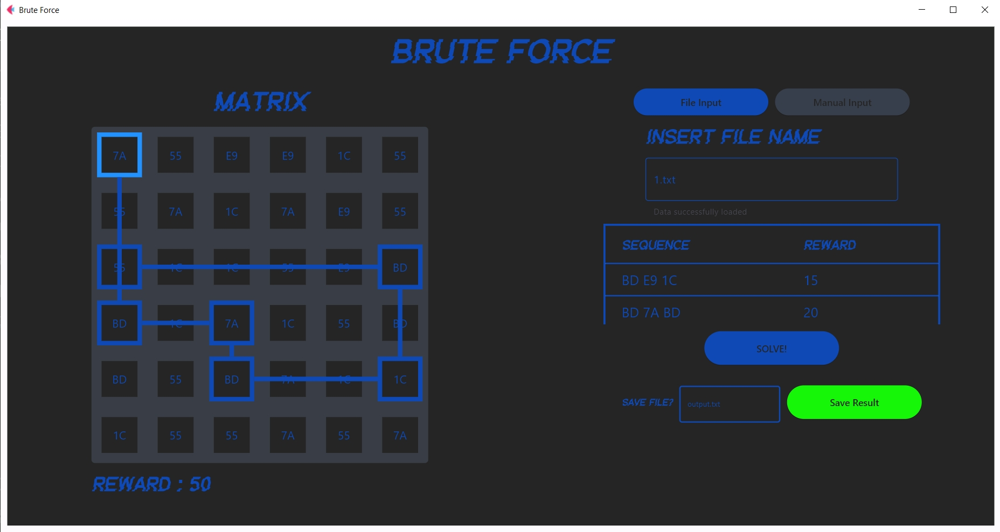
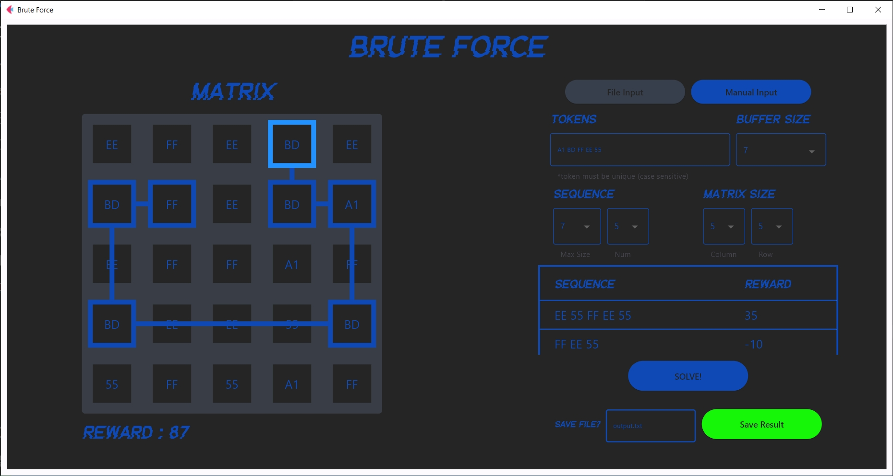

# Tucil1 - 13522103
> Tugas Besar 2 IF2123 Aljabar Linier dan Geometri 
>
> Aplikasi Aljabar Vektor dalam Sistem Temu Balik Gambar Semester I Tahun 2023/2024

## Table of Contents
* [General Info](#general-information)
* [Technologies Used](#technologies-used)
* [Features](#features)
* [Screenshots](#screenshots)
* [Setup](#setup)
* [Usage](#usage)
* [Project Status](#project-status)
* [Room for Improvement](#room-for-improvement)
* [Contact](#contact)

## General Information
- This project aims to solve the _Cyberpunk 2077 Breach Protocol_ minigame by _Brute Force_ Algorithm. The minigame simulates hacking on local network from _ICE (Intrusion Countermeasures Electronics)_ on _Cyberpunk 2077_.

## Technologies Used
- Python - version 3.11.0

## Features
- Input(s) validation (CLI and GUI)
- Generate matrix and sequence(s) (CLI and GUI)
- Load matrix and sequence(s) information from .txt file (CLI and GUI)
- Save solution into .txt file (CLI and GUI)
- Show the solution token path on the matrix (GUI)
- Scrollable _sequence-value_ table (GUI)

## GUI Screenshots

## Setup

### Windows

#### CLI

1. From Tucil1_13522103 directory, navigate to "src" directory

    `cd src`

2. Run Main.py program

    `python Main.py`

#### GUI

1. From Tucil1_13522103 directory, navigate to "src" directory

    `cd src`

2. Install flet

    `pip install flet`

3. Run app.py program

    `python app.py`
    
### Linux / WSL

#### CLI

1. From Tucil1_13522103 directory, navigate to "src" directory

    `cd src`

2. Run Main.py program

    `python3 Main.py`

#### GUI

1. From Tucil1_13522103 directory, navigate to "src" directory

    `cd src`

2. Install flet

    `pip install flet`

3. Install GStreamer

    `sudo apt install libgtk-3-0`

    `sudo apt-get install gstreamer1.0-plugins-bad gstreamer1.0-plugins-ugly gstreamer1.0-libav`

    `sudo apt-get update`

    `sudo apt-get install libgstreamer1.0-dev libgstreamer-plugins-base1.0-dev libgstreamer-plugins-bad1.0-dev gstreamer1.0-plugins-base gstreamer1.0-plugins-good gstreamer1.0-plugins-bad gstreamer1.0-plugins-ugly gstreamer1.0-libav gstreamer1.0-doc gstreamer1.0-tools gstreamer1.0-x gstreamer1.0-alsa gstreamer1.0-gl gstreamer1.0-gtk3 gstreamer1.0-qt5 gstreamer1.0-pulseaudio`

4. Run app.py program

    `python3 app.py`

## Usage
1. Choose input from .txt file or manual input, manual input will generate matrix and sequence(s)
2. When brute force process is finished, the result will appear
3. Save the result if you want

## Project Status
Project is: _complete_.

## Room for Improvement
- Program modularity on GUI program (app.py)
